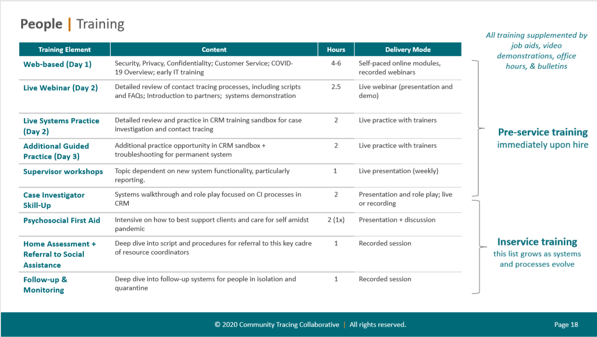

# H1. How to do it

To effectively execute contact tracing for COVID-19, most governments will need to support:

* Workforce expansion
* Laboratory testing
* Isolation and quarantine
* Monitoring and evaluation
* Data management systems
* Technology enablement
* Defining roles

In the coming sections we review strategies organizations can use to quickly increase capacity in each of these areas.

## Workforce Expansion

While contact tracing is routinely performed to control STDs, TB, and other communicable diseases, local health departments have limited front-line workforce \(e.g., epidemiologists, disease intervention staff, public health nurses\) to support contact tracing at the scale and pace of COVID-19. The [CDC provides resources](https://www.cdc.gov/coronavirus/2019-ncov/php/open-america/staffing.html) for training and supplementing existing staff for ongoing and surge support.

### Population-based estimates

For contact tracing to be effective, every diagnosed case must be investigated, which means the contact tracing workforce must be capable of responding quickly even during surges. [Find the number of staff you’ll need](https://preventepidemics.org/coronavirus/resources/contact-tracing-staffing-calculator/) using this calculator provided by public health organization [Resolve to Save Lives](https://resolvetosavelives.org/), and review additional estimates below.

| **Source of estimate** | **Estimated number of contact tracing staff per 100k population** |
| :--- | :--- |
| Massachusetts/Partners in Health \(initial staffing, which PIH believes will need to be increased subsequently\) | 14 |
| Johns Hopkins/Association of State and Territorial Health Officers | 30 |
| Resolve to Save Lives | 100 |

### Roles needed

| **Role** | **Who can fill** | **Description** |
| :--- | :--- | :--- |

<table>
  <thead>
    <tr>
      <th style="text-align:left"><b>Contact tracers</b>
      </th>
      <th style="text-align:left">
        <ul>
          <li>Local lay people trained and supervised by disease intervention specialists</li>
          <li>Volunteers from academic public health community</li>
        </ul>
      </th>
      <th style="text-align:left">
        
Communicate with contacts to gather data and inform about quarantine procedures.

        
May work remotely during shelter-in-place (e.g., one-on-one phone interviews
          or text-based messaging services) or in-person.

      </th>
    </tr>
  </thead>
  <tbody></tbody>
</table><table>
  <thead>
    <tr>
      <th style="text-align:left"><b>Case investigators</b>
      </th>
      <th style="text-align:left">
        <ul>
          <li>Community health workers</li>
          <li>Disease intervention specialists</li>
          <li>Nurses</li>
        </ul>
      </th>
      <th style="text-align:left">
        
Interview confirmed or suspected COVID-19 cases.

        
Interview newly diagnosed cases to determine period of infectiousness,
          elicit contacts, and identify clinical and other resource needs.

        
Delegate appropriate administrative work to contact tracers (e.g., finding
          contact information, reviewing isolation and quarantine recommendations
          and resources)

      </th>
    </tr>
  </thead>
  <tbody></tbody>
</table><table>
  <thead>
    <tr>
      <th style="text-align:left"><b>Care resource manager</b>
      </th>
      <th style="text-align:left">
        <ul>
          <li>Social workers</li>
          <li>Case managers</li>
        </ul>
      </th>
      <th style="text-align:left">
        
Arrange wrap-around services (e.g., food, medication delivery) for cases
          and contacts in isolation or quarantine.

        
Provide incentives, food, or referral to programs that provide financial
          assistance.

      </th>
    </tr>
  </thead>
  <tbody></tbody>
</table><table>
  <thead>
    <tr>
      <th style="text-align:left"><b>Clinical consultant</b>
      </th>
      <th style="text-align:left">
        <ul>
          <li>Nurses</li>
          <li>Nurse practitioners</li>
          <li>Physicians</li>
        </ul>
      </th>
      <th style="text-align:left">Provides clinical support to case investigators or contact tracers if
        cases/contacts become symptomatic or require referral to the hospital.</th>
    </tr>
  </thead>
  <tbody></tbody>
</table><table>
  <thead>
    <tr>
      <th style="text-align:left"><b>Data analyst</b>
      </th>
      <th style="text-align:left">
        <ul>
          <li>Local lay people trained and supervised by disease intervention specialists</li>
          <li>Volunteers from academic public health community</li>
        </ul>
      </th>
      <th style="text-align:left">Data monitoring and analysis</th>
    </tr>
  </thead>
  <tbody></tbody>
</table><table>
  <thead>
    <tr>
      <th style="text-align:left"><b>Data entry technician</b>
      </th>
      <th style="text-align:left">
        <ul>
          <li>Local lay people trained and supervised by disease intervention specialists</li>
          <li>Volunteers from academic public health community</li>
        </ul>
      </th>
      <th style="text-align:left">Careful data entry, review, and correction</th>
    </tr>
  </thead>
  <tbody></tbody>
</table>The [Massachusetts Department of Public Health, in partnership with Partners in Health](https://www.mass.gov/doc/community-tracing-collaborative-overview-presentation/download), has [shared its plans for scaling](https://www.mass.gov/doc/community-tracing-collaborative-overview-presentation/download) and training its contact tracing workforce.

## Laboratory testing

Increasing testing capacity and ensuring rapid turnaround time \(from symptoms, to testing, to test result delivery to both the patient and the health department\) are key to “slowing the spread”.

### Polymerase Chain Reaction \(PCR\) testing

Polymerase Chain Reaction \(PCR\) testing is [the current gold standard](https://spectrum.ieee.org/the-human-os/biomedical/diagnostics/testing-tests-which-covid19-tests-are-most-accurate) for COVID-19. For contact tracing to be most effective, PCR testing should be widespread and available to all people showing symptoms. The CDC provides [detailed recommendations for testing protocol and best practices](https://www.cdc.gov/coronavirus/2019-nCoV/hcp/clinical-criteria.html).

### Asymptomatic testing

There is [increasing evidence of transmission from asymptomatic and pre-symptomatic cases](https://www.cdc.gov/mmwr/volumes/69/wr/mm6914e1.htm), and it is likely that a significant proportion of patients would test positive for COVID-19 without symptoms \(e.g., [20% in South Korea; 50% in Iceland](https://www.bloomberg.com/news/articles/2020-03-22/one-third-of-coronavirus-cases-may-show-no-symptom-scmp-reports)\).

Contact tracing will not prevent transmission from untested asymptomatic cases. Because asymptomatic testing accuracy and feasibility rates are still preliminary, even if communities _do_ test asymptomatic contacts, negative results would not change quarantine recommendations. The CDC [provides guidance on testing asymptomatic contacts](https://www.cdc.gov/coronavirus/2019-ncov/php/guidance-evaluating-pui.html) of people diagnosed with COVID-19.

### Serology testing

Serology testing for COVID-19 to identify past infection and presumed immunity is [still being developed](https://www.cdc.gov/coronavirus/2019-ncov/lab/serology-testing.html), and its role and potential use in contact tracing is still unclear. In particular, [sensitivity and specificity of serology tests vary widely](https://www.medrxiv.org/content/10.1101/2020.04.25.20074856v1) and must be further validated before guiding decision-making.

## Isolation and quarantine

Isolation \(the separation of persons with confirmed or suspected contagious disease\) and quarantine \(separation/restriction of movement of persons that have been exposed to a contagious disease\) are critical to stopping COVID-19 transmission.

Enforcing isolation and quarantine requires resources and systems, including strategies for securing location and ensuring food, nutrition, and medication, and financial support. People in isolation and quarantine require continued monitoring in case they require further care or testing.

### Location

Case investigators and contact tracers will assess the most appropriate place for isolation and quarantine--either at home, in a government-secured location \(e.g., hotel\), or in a hospital.

### Provisions

Care resource managers ensure access to nutrition and required medications, whether by neighbor, friend, family member, or delivery service.

### Other needs

Case investigators? should assess for potential challenges of isolation and quarantine, including loss of income and loss of ability to care for others, that may make compliance difficult. Public health programs such as tuberculosis control programs have provided “incentives and enablers” for this purpose. Examples include covering mortgage or rent payments, providing daycare or elder care, and others. Direct financial compensation for those with lost wages should be considered.

### Legal authority

Health officers have legal authority to order isolation and quarantine. Local programs may vary in their approach. Some issue orders immediately whereas others seek voluntary cooperation without a legal order initially. States may need to provide additional support if local health departments need mass provision, monitoring, or enforcement of legal orders.

## Program evaluation

Governments can use predefined performance targets to determine the efficacy of its contact tracing program. These metrics can be used in tandem with broader metrics tracking cases and mortality rate to consider loosening and tightening social restrictions.

### Example metrics and targets for contact tracing

| **Possible criteria to loosen restrictions** | **Possible criteria to tighten restrictions** | **Other performance metrics** |
| :--- | :--- | :--- |

<table>
  <thead>
    <tr>
      <th style="text-align:left">
        <ul>
          <li>
            <ul>
              <li>
                <ul>
                  <li>100% of cases interviewed for contact elicitation/ identification</li>
                  <li>Contacts elicited for at least 90% of cases</li>
                  <li>100% of symptomatic contacts and others with symptoms undergo testing
                    within 12 hours of identification of symptoms</li>
                </ul>
              </li>
            </ul>
          </li>
        </ul>
      </th>
      <th style="text-align:left">
        <ul>
          <li>
            <ul>
              <li>
                <ul>
                  <li>Cannot elicit contacts for 20% or more of cases</li>
                  <li>10% or more of symptomatic contacts fail to get tested or are tested in
                    more than 24 hours of symptom onset</li>
                </ul>
              </li>
            </ul>
          </li>
        </ul>
      </th>
      <th style="text-align:left">
        <ul>
          <li>
            <ul>
              <li>
                <ul>
                  <li>% of cases with complete contact information</li>
                  <li>% of cases reached by case investigator within 12 hours of positive lab
                    result</li>
                  <li>% of cases providing at least one contact to investigator</li>
                  <li>% of contacts with complete contact information</li>
                  <li>% of contacts reached by contact tracer within 24 hours of elicitation</li>
                </ul>
              </li>
            </ul>
          </li>
        </ul>
      </th>
    </tr>
  </thead>
  <tbody></tbody>
</table>Contact tracing requires and produces a lot of data, particularly given current all-remote shelter-in-place workforce, making efficient data management crucial to any program’s success.

\[Flow chart of data here\]

### Principles of data management

1. Make collected data accessible: The format of a positive laboratory test result for COVID-19, as well as the necessary associated patient information, should be accessible to both clinical and public health entities in either “near real time” or in aggregate as necessary. Ideally patient data is ultimately shared with the patient’s provider.
2. Import relevant available health data: A system capable of automatically importing relevant prior contact, demographic, and clinical records would substantially reduce the burden on the contact tracing and medical workforce. Regulatory barriers to accessing this information \(e.g., HIPAA Minimum Necessary restriction\) can be overcome with a [statement from the federal HHS Office of Civil Rights](https://www.hhs.gov/hipaa/for-professionals/privacy/guidance/minimum-necessary-requirement/index.html) or an assertion from the State.
3. Make data usable: Investing in the above principles to aggregate and access relevant health information will be wasted if contact tracers and other public health employees aren’t clear on how to access it and then share relevant recommendations with cases and contacts. Ideally, programs have easy-to-use user interfaces for data review and entry, but, alternatively, detailed visual training programs can ensure the workforce is taking advantage of useful data.

### Negotiating data rights with vendors

Software vendors may attempt to contract their ownership over data in an attempt to lock in customers. Programs must avoid this by specifying in the vendor contract that vendors do not own any data via a “data rights” clause such as:

“Consistent with [FAR 52.227-14](https://www.acquisition.gov/content/52227-14-rights-data-general), which applies to this agreement, the State intends that data stored within the software provided by the Contractor will be owned by the State.”

Programs must also specify in the vendor contract that the vendor agrees to export records in a machine-readable format \(defined as “data in a format that can be easily processed by a computer without human intervention while ensuring no semantic meaning is lost”\), and the software must likewise be demonstrated to provide such functionality.

## Legal & data sharing frameworks

Summary:

* Establish legal data sharing frameworks within state jurisdictions, e.g. local/municipality to city \(major metro\), and direct to state.
* Consider formulating policies and orders at the local jurisdiction level that refer to specific data sharing regulations that permit reporting; i.e. healthcare providers having the ability to share data with **specific entities** related to contact tracing efforts and what data will be released for broad public consumption vs. restricted public health use.
* Designate certain collaborative entities with limited public health authority related to COVID-19 e.g. Health Information Networks, and Health Information Exchanges typically can’t easily share data bi-directionally with public health; state-based entities \(e.g. New Jersey Health Information Network, Indiana HIE, SHINY\) will be able to move faster on sharing clinical information with public health to scope contact tracing efforts
* Define data sharing use cases that fall under the following:
  * Public Health Practice
  * De-identified Data \(per HIPAA\); aggregate and line-level
  * Consumer Data \(non-HIPAA; regulated by FTC
  * Anonymous Data
  * Open Data \(public consumption\)
* Patient and Consumer Consents
* Data destruction policies

### State & Local Jurisdiction Data Sharing

If there is a local NEDSS system in place, provide local jurisdictions with the ability to enter case reports. Establish a process to capture case investigations that relate to emerging contract tracing emergence of symptoms but confirmatory testing may not be in place yet \(typically a quarantine section of the system to help prioritize confirmed case reports\).

### Data Sharing Use Cases

* Symptom checker information into a NEDSS
* Symptom checker information connected with contact traced social network \(identifiable, and aggregate level\)
* Contact-traced individuals to healthcare records/testing \(consent\)
* Surveillance of negatives for a certain period of time with symptom checker & monitoring tools

**Public Health Practice**

Covers the following:

* Healthcare provider to public health
* Clinical data provider \(Labs, EHRs, Payors & their vendors\) to public health
* Behavioral and mental health data provider to public health
* Public health to public health; state and local jurisdictions
* Local state agencies \(e.g. Departments of Human Services, Prison & Correctional Facilities\) to public health
* Local public health to federal public health

Permissible data linkages:

* Identifiable data \(PHI or PII\) to consumer-consented data
* Limited data to identifiable data
* De-identified data to identifiable data \(re-identification under public health practice\)
* De-identified data to de-identified data

**De-identified Data**

Covers the following:

* Healthcare providers to public health

**Consumer Data**

**Open Data**

## How to fulfill and scale each roles and functions -- human and tech enablement

## Technology enablement

Technology cannot remove the need for scaled-up workforces to execute contact tracing. However, technology will enable contact tracing workforces to effectively address the unprecedented scale, speed, and accuracy demanded by the COVID-19 crisis. Cloud-based technology tools can accelerate key functions including:

* Workforce management
* Case management
* Alerts
* Call center and triage

Most government organizations already have contact tracing infrastructure and technology support in place for infectious diseases like HIV or syphilis, but this technology may not be easy to adapt to contact tracing for COVID-19. A good first step is to review your existing workflow and infrastructure and use the following checklist to identify where you might need to invest in new technologies \(versus where your current solution will be sufficient\):

| **Priority** | **Task** | **Requirements** | **Recommended solutions** |
| :--- | :--- | :--- | :--- |

| High | Transfer positive test results from labs to the health department | 24-hour time window | Set up secure electronic integrations between labs and your state, county, and cities |
| :--- | :--- | :--- | :--- |

<table>
  <thead>
    <tr>
      <th style="text-align:left">Low</th>
      <th style="text-align:left">Minimize data entry errors, clean/correct them when they occur</th>
      <th
      style="text-align:left">Ability to flag errors</th>
        <th style="text-align:left">
          
Electronic lab registration software

          
Data auto-correct

        </th>
    </tr>
  </thead>
  <tbody></tbody>
</table><table>
  <thead>
    <tr>
      <th style="text-align:left">Medium</th>
      <th style="text-align:left">View/find contact information for the positive case</th>
      <th style="text-align:left">
        
Reconcile conflicting test results

        
Stack rank cases

        
Access management

      </th>
      <th style="text-align:left"></th>
    </tr>
  </thead>
  <tbody></tbody>
</table>|  | Get in touch with the positive patient and find to inform them of their diagnosis, connect them to care, and interview them about their contacts \(this is not always done by the same person or at the same time\) |  |  |
| :--- | :--- | :--- | :--- |

|  | Interview the positive patient about their contacts \(that they might have exposed or might have exposed them\), and prioritize based on likelihood of transmission |  |  |
| :--- | :--- | :--- | :--- |

|  | Decide which contacts will be notified by the positive patient vs the health department [\(“provider referral” vs “patient referral”](https://academic.oup.com/cid/article/44/Supplement_3/S160/496779)\) |  |  |
| :--- | :--- | :--- | :--- |

|  | For contacts that will be notified via patient referral, equip the patient with information and possibly referral cards |  |  |
| :--- | :--- | :--- | :--- |

|  | Decide whether to give the patient medication to bring their contacts \(“expedited partner therapy”\), and if so provide them with the necessary medication and instructions |  |  |
| :--- | :--- | :--- | :--- |

|  | Find contact information for the positive patient’s contacts who will be notified by the health department |  |  |
| :--- | :--- | :--- | :--- |

|  | Get in touch with the contact and find a time to talk to them |  |  |
| :--- | :--- | :--- | :--- |

|  | Inform the contact of their possible exposure, and connect them to testing & care as appropriate |  |  |
| :--- | :--- | :--- | :--- |

|  | Sometimes, follow up with contact to see whether they were tested |  |  |
| :--- | :--- | :--- | :--- |

|  | Train contact tracers on how to perform contact tracing effectively and ensure the privacy of patients and contacts |  |  |
| :--- | :--- | :--- | :--- |

Your underlying database of positive cases was not built for COVID-19. You might use the state’s system to source new cases, or your county or city might have its own. Test results will come in from hospitals, clinics, private labs, and public labs. These results might come in electronically through an online integration or portal as HL7 feeds, CSVs, or other raw data files. They also might be entered in by hand to the city or state database from someone directly looking up information about the case in the clinic’s EMR \(electronic medical record\) system, by someone who has received a paper copy of the lab, or by a courier who has brought an electronic file to the city, county, or state on a thumb drive, CD-ROM, or floppy drive. Ideally, you would set up secure electronic integrations between labs and your state, county, and cities so that data can be sent instantly and without alteration.

Even if you are able to get electronic data directly from the lab, the data from the lab will not be free of typos. Patient names and contact information will inevitably be misspelled, because usually this information is hand-written by the patient on a paper form, and then manually typed in by someone at the lab or by the healthcare provider. Anywhere along the chain, technology can play a role in flagging and even automatically correcting common errors, such as “gnail.com” or “gmail.con.” The earlier along the chain this correction happens, the better. Technologies that enable patients to register electronically during or before their visit to the lab, and that conduct field checks on the data entered by the patient \(e.g. a phone number is missing a digit\), will help ensure that the data seen by contact tracers is accurate.

Your system might also need to adapt to treat patients who were never tested or whose test results are pending as presumptive positives in need of care and/or contact tracing. Lab data alone will not then get you the information you need, and further integrations and processes to get data from providers will be necessary.

In addition to getting data from providers and labs, your system will need to know how to interpret those data to flag what cases should be interviewed. A patient could be tested twice with a PCR test on the same day, and have one test come back positive and another negative. A patient could get tested for antibodies and have a positive antibody test, but no longer be worthwhile to interview for contact tracing. Your database and processes will need to handle patients getting tested more than once, with multiple types of tests that mean different things, at many different locations.

Even with a large number of contact tracers, you will need to have the ability to prioritize among positive patients, and your database needs to have the information in it that would guide this prioritization. Examples of data that would be useful \(beyond “test result negative vs positive”\) include:

* Date of test
* Type of test
* Date of symptom onset \(might not be available in lab data, but is helpful for determining infectious period & original date of infection\)
* Other test results for the same patient
* Risk factors \(?\)

Lastly, your contact tracers need to have access to the database of patients they need to interview \(“index cases”\), and know which ones to reach out to. This does not need to be the same database your health department uses because:

* COVID-19 contact tracers only need access to data about a subset of all infectious disease patients, and a subset of COVID-19 cases
* your department database might not be accessible to people who are not in-person using health department desktops
* there might not be an underlying need for your department database to have information about COVID-19 contacts in it

If you do separate your systems, you’ll need to figure out how to get data from your department database of cases into any database / technology being used by contact tracers, and identify which of these databases is the “source of truth” on COVID-19 cases. If it’s your department database, you’ll want to develop a process or integration that allows contact tracers to flag things that are “off” about COVID-19 patient information, such as a disconnected phone number or an email that bounces back, and ensure that information can be corrected in both the database that contact tracers are using and the database being used by the department for the tracking and management of COVID-19 cases.

### Tech-enabled case interviews, contact elicitation, & contact investigation

Once you have your database of cases, cases need to be informed of their diagnosis and interviewed. Quite a bit needs to happen in order to connect the index case to care, ensure they are less likely to infect others \(e.g. connect them to an isolation hotel if they can’t isolate at home\), and elicit contacts. You’ll need to decide who is in charge of what part of this, and whether the person interviewing a patient about their contacts and possible sources of exposure is also performing other functions such as delivering test results or connecting patients to care. If they are performing these other functions, you’ll want to ensure that any database they use allows them to track these activities appropriately.

Technology can play an important role in delivering test results, and even in helping supplement contact elicitation interviews that would otherwise be done on the phone. Some health departments are using third-party vendors like [Healthvana](http://healthvana.com/) to deliver COVID-19 test results and instruct positive patients on which contacts to notify and how to notify them. Index case interviews can be done digitally as well, by having patients fill out an online form about their close contacts and recent activities. These forms are not perfect - not all index cases will feel comfortable filling them out or have private internet access, the form won’t be able to ask probing questions that an interviewer might, and a form can’t build rapport or demonstrate empathy the way a human can. But these forms can scale well, can be available in multiple languages, can be filled out by the patient at any time, and can improve the speed of and accuracy of data collection versus a traditional interview.

Technology can also help with prompting the index patient to remember their contacts or possible exposures. An interviewer can ask an index case to look at their calendar, their text messages, their food delivery apps, their phone geolocation data, and other sources of private electronic tracking and communication that can help the case to remember when their symptoms started, where they’ve been, and who they had in-person contact with.

In addition to trying to elicit the names of contacts, an interviewer will also try to identify ways to reach out to the contact. The index case might have a variety of ways they communicate with or can locate their close contacts, some of which can be used by contact tracers and others that are best suited for conversations just between the patient themselves and their contact. These could include:

* Phone number
* Email address
* Username in various social media platform \(e.g. dating apps, facebook, instagram, etc\)
* Physical address
* Place of work or places commonly visited

Technology can support this by enabling the index case to search through their various contact lists for multiple methods of getting in touch with their close contacts. This could be done by an app the index case would download onto their smartphone, and then setting up integrations with their phone’s contact list, their email client, and their social media apps. The index case could then search for a given contact’s names in all digital locations simultaneously, enabling them to more easily notify those contacts themselves or provide this information to the interviewer.

Once some information about a contact is given to an interviewer, they might want to do their own search for methods of contacting them, especially if the methods provided by the index case don’t seem to be working. This is also true for instances where the lab provides incomplete information about the index case themselves. Technology can make it easier to search multiple databases simultaneously to try to find alternate methods for contacting individuals.

### Tech-enabled contact prioritization & notification

Once contacts have been elicited, they need to be prioritized for follow-up by contact tracers. In traditional contact tracing, often not every case is notified by the health department, or at least not for all infectious diseases. Often the patient themselves is asked to notify their close contacts as well, and provided with help doing so. This is for several reasons:

* Index patients might not want to provide contact tracers with the names of all their close contacts, especially if the contact is undocumented or if one or both parties were not following local ordinances when they were in touch
* Contacts might not answer the phone when called from an unknown number, or open an email from an unknown email address, whereas they would pick up if a friend was calling
* Health departments rarely have the capacity to reach out to all possible contacts, and want to focus their resources on hard-to-reach contacts that can’t be notified by other means

In addition to prioritizing contacts based off of which need to be contacted via provider-referral \(vs peer-to-peer patient referral\), a health department might also want to prioritize contacts who:

* Are especially likely to have been infected by the index case. This would be influenced by:
  * the timing of the interaction - e.g. contacts who were with the index case three days before symptoms appeared would be less likely to be infected than a contact from the day after symptoms appeared
  * the duration of the interaction - e.g. contacts who were with the index case for 3 hours would be more likely to be infected than those who spent two minutes with the patients
  * the location of the interaction - e.g. contacts who were indoors or in a contained environment like a car with the patient would be more likely to be infected than those who were outside in a park \(we think\)
  * whether the index patient was coughing or engaging in behavior that would increase the probability that an infectious dose of the virus would leave their body and enter the other person
* Are especially likely to infect others, if not notified and/or provided with services, for example:
  * Individuals who live in close quarters with other people
  * Individuals who are working essential jobs and leaving their home regularly
* Are especially likely to develop serious illness, if not notified and/or provided with services, for example:
  * Older individuals
  * Individuals with relevant underlying conditions or who are immunocompromised
* Are especially likely to have infected the index case, for example:
  * Close contacts from 2-14 days, especially around 3-6 days, from before the index case started to show symptoms
  * These are generally prioritized less highly for provider-referral notification, because these contacts might already be past their infectious period

Technology can play an important role in sorting through and prioritizing these contacts on these various vectors, enabling health departments to more rapidly prioritize who to notify in what order, and how much effort to expend on contacts who are not easily reached.

In addition to supporting contact prioritization, technology can help with the notification itself. This can be done by providing contact tracers with templates for outreach that they can use for manual emailing or texting of contacts. This can also be done by automatically alerting contacts using pre-set templates \(e.g. the software sends the text message rather than the contact tracer using their own phone\), or with robo-calls to contacts. These interactions can be tracked or automated in a database such as Salesforce, enabling contact tracers to easily see that status of outreach to contacts.

In addition to supporting the sending of a contact notification, technology can help with connecting the contact to testing and / or care. A number of COVID-19 testing location finders exist, such as [Google](https://www.theverge.com/2020/4/17/21225828/google-showing-covid-19-testing-centers-search-results) or [findcovidtesting.com](https://findcovidtesting.com/).

### Tech-enabled contact follow-up

Once a contact has been notified, you may want to follow up with them to ensure they have been tested, encourage them to stay isolated for the 14 days after exposure, and learn more about their symptoms. An increasing number of technologies are being developed to support this, such as [CommCare](https://www.dimagi.com/commcare/) or [Sara Alert](https://saraalert.org/).

### Peer-to-peer contact notification

Technology can enable patients to notifying their own contacts \(if they know their identities\).

Anonymous peer-to-peer mass partner notification systems already exist for STDs \(e.g., [Tell Your Partner](https://tellyourpartner.org/), [Let Them Know](https://letthemknow.org.au/)\), and are beginning to be adapted to support COVID-19 peer-to-peer notification \(e.g., [Tell Your Contacts](https://tellyourcontacts.org/)\).

In addition to helping diagnosed individuals deliver the message, [templates](http://web.archive.org/web/20161222151021/https://www.sotheycanknow.org/inform/text) could make it easier to figure out what to say and [automated suggestions based on timing of test results and symptom onset](http://web.archive.org/web/20160910061632/https://www.sotheycanknow.org/chlamydia#inform_your_partner) could make it easier to decide who to notify. Technology could also enable automated information distribution to contacts about where/whether to get tested, symptom education and monitoring, guidance on isolation/quarantine, and available support and services.

### Tech-enabled recruiting and training of contact tracers

As we consider rapidly scaling up the contact tracing workforce, technology can play a vital role in recruiting, selecting, and training contact tracers.

[GC Talent Reserve](https://talent.canada.ca/en/response) \([open source code](https://github.com/GCTC-NTGC/TalentCloud)\) is one example of how governments can use technology to recruit contact tracers who are already government employees to fill emergency roles.

[Making Contact: A Training for COVID-19 Contact Tracers](https://www.ncsddc.org/resource/making-contact-a-training-for-covid-19-contact-tracers/) is an example of how technology can be used to rapidly train entry-level COVID-19 contact tracers.

### Support people in isolation

### Emerging Bluetooth technology solutions

Apple and Google recently announced a partnership to leverage Bluetooth LE technology to support voluntary proximity tracking. This could theoretically automate portions of contact tracing: once a case is diagnosed, apps could notify others who were in proximity to the diagnosed individual during the infectious period.[\[1\]](how-to-do-contact-tracing.md)

For privacy purposes, this technology relies on a “double opt-in”, meaning that both diagnosed and contacts would have to opt in to be traced or notified.

While this technology has potential, it is in its early stages. Based on our review to date, we do not recommend it be a “load-bearing pillar” of contact tracing work for the following reasons:

* **Insufficient coverage.** Since this approach is voluntary, coverage is limited to those who choose to participate. If only 40% participates \(a liberal estimate given [adoption rates in other countries](https://www.reuters.com/article/us-health-coronavirus-apps/bluetooth-phone-apps-for-tracking-covid-19-show-modest-early-results-idUSKCN2232A0)\), it would still only cover 16% of the population.[\[2\]](how-to-do-contact-tracing.md) As a result, a manual contact tracing program is still necessary even with relatively broad adoption.
* **Biased coverage.** We should anticipate [lower adoption in vulnerable populations due to language barriers, limited technology access, and more](https://www.pewresearch.org/internet/fact-sheet/mobile/). As a result, over-reliance on this approach could disproportionately divert resources from vulnerable populations.
* **Still under development.** Google and Apple will be launching APIs in May, which will delay the creation of applications. In addition, accurate proximity algorithms are still under development, and issues such as rates of false positives and margins of error are unknown.
* **Outstanding privacy and security questions.** While Google and Apple are pursuing a privacy-centric approach, ensuring privacy in practice is another matter. Privacy experts have expressed concern that location could potentially be inferred from proximity by, for example, hackers or aggressive nation states.

## Review of Vendors - Pros and Cons

## FAQs

## Other Resources / Playbooks

[CDC](https://www.cdc.gov/coronavirus/2019-ncov/php/open-america/contact-tracing.html)

[ASTHO](https://www.astho.org/COVID-19/A-National-Approach-for-Contact-Tracing/)

[Hopkins & ASTHO](https://www.centerforhealthsecurity.org/our-work/pubs_archive/pubs-pdfs/2020/200410-national-plan-to-contact-tracing.pdf)

[NCSD \* ASTHO](https://www.ncsddc.org/resource/making-contact-a-training-for-covid-19-contact-tracers/)

[NCSD](https://www.ncsddc.org/covid-command-center-std-program-resources/)

Resolve to Save Lives

